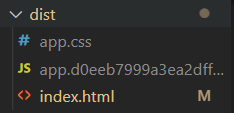

## 웹팩이란?

웹팩이란 자바스크립트를 위한 모듈 번들러이다.

### 프로젝트 내 웹팩 버전 확인 방법

`npm view webpack version`

## 웹팩을 사용하면 얻게 되는 이점

1. http 요청/응답 횟수를 줄일 수 있다.
   웹팩을 사용하지않으면 여러 파일에 대하여 요청/응답을 여러번 해야한다.
   요청/응답 횟수가 여러 번이라면 그만큼 시간도 오래걸린다는 것이다.
   웹팩은 여러 파일을 한 파일로 번들링해주므로써 요청시 하나의 파일만 받아오면 된다.

## 웹팩을 커스텀하여 사용하는 이유?

따로 설정해줘야할 부분들이 있기때문에
하지만 eject를 하면 복잡하기 때문에 필요한 부분만 커스텀하기 위하여 이를 위한 라이브러리를 사용하는 것을 권장한다.

- https://www.reddit.com/r/reactjs/comments/omgdwq/why_and_when_to_use_a_custom_webpack/

## 웹팩 오버라이딩 라이브러리

웹팩을 커스텀하여 사용하기 위해서는 npm run eject를 사용하여 설정파일들을 들춰내야한다.

하지만 이 방법을 사용하는 것은 CRA DOCS와 여러 블로그 포스팅의 경험담에서 비추하는 편인 것 같다.

그래서 다른 방법을 찾아보니 기존 설정에 오버라이딩(새로운 설정 덮어씌우는 방법)을 할 수 있는 라이브러리들이 존재했다.

**npm downloads**


customize-cra,react-app-rewired,craco 세 가지 라이브러리가 있는데 사용량을 보니 react-app-rewired,craco 이 두 가지를 많이 사용하는 것으로 보인다.

craco와 react-app-rewired라이브러리의 npm download 수가 **비슷한 것**으로 나타난다.

추후에 따로 라이브러리를 사용하여 오버라이딩을 해봐야겠다.

## 설치할 모듈

웹팩을 사용하기 위해 전반적으로 **설치해야할 모듈**을 살펴보자.

#### **webpack**

**전반적인 웹팩 기능들을 사용**할 수 있게 해주는 모듈이다.

#### **webpack-cli**

커맨드 라인으로 **웹팩 명령어를 사용**할 수 있게 해준다.

#### **babel-loader , @babel/core**

**바벨과 웹팩을 같이 사용**하기 위해 필수로 설치해줘야하는 모듈

#### **@babel/preset-env**

브라우저에 필요한 **ecmascript 버전을 자동으로 파악**해서 알아서 **polyfill**을 넣어준다.

#### **@babel/preset-react**

**리액트**와 같이 사용할 때 설치해주면 되는 모듈이다.
jsx를 js로 변환해준다.

#### **@babel/preset-typescript**

**타입스크립트**와 사용할 때 설치해주면 되는 모듈

#### css-loader

js내에서 css 파일을 import할 수 있게 해준다.

#### style-loader

css파일을 style 태그로 만들어 head에 넣어준다.

#### html-webpack-plugin

웹팩 번들에 html파일을 제공한다.
번들링된 js파일을 html에 자동으로 제공해줘 html에 script태그로 로드할 필요가 없다.

#### webpack-dever

웹팩 개발서버를 구동할 수 있게 해준다.

## webpack.config.js

해당 파일이 있어야 웹팩이 파일의 설정대로 인식하여 웹팩을 실행해준다.

타입스크립트라면 webpack.config.ts라고 파일을 만들어주면 된다.
이 때 `@types/webpack`도 같이 설정해줘야한다.

```js
const webpack = require("webpack");

module.exports = {
  mode: "development",
  entry: {
    app: "",
  },
  output: {
    path: "",
    filename: "",
    publicPath: "",
  },
  module: {},
  plugins: [],
  optimization: {},
  resolve: {
    modules: ["node_modules"],
    extensions: [".js", ".json", ".jsx", ".css"],
  },
};
```

#### entry

**entry**는 번들링할 파일에 대한 **진입점**이다.
즉 , 웹팩이 **파일을 읽어들이기 시작**할 부분이다.

**1번**

```js
entry: './path/to/my/entry/file.js',
output: {
    filename: 'bundle.js',
  },
```

**2번**

```js
entry: {
  app: "./src/index.js";
}
```

1번과 같이 설정되어있다면 해당 경로에 있는 .../file.js에 진입하여 번들링을 한다.

2번과 같이 설정되어있다면 **src/index.js파일부터** 읽어들이기 시작하여 연관된 **여러 파일들을 알아서 파악**한 뒤에 **app.js라는 파일로 번들링**해준다.

**객체의 키**로 설정한 이름(app.js)의 파일로 번들링된다.

**3번**

```js
module.exports = {
  entry: ["./src/file_1.js", "./src/file_2.js"],
  output: {
    filename: "bundle.js",
  },
};
```

또한 여러 진입점 파일을 설정할 수 있다.
3번의 예시에서는 두 개의 파일 file_1.js와 file_2.js라는 두개의 진입파일을 통해 하나의 bundle.js라는 파일로 번들링된다.

#### [output](https://webpack.js.org/configuration/output/)

output은 **번들링된 결과물이 어떻게 나오며 어디로 결과물을 배치**할 것인지에 대해 설정할 수 있는 옵션이다.

```js
output : {
path : "/dist",
filename : "[name].js"
}
```

**path** 옵션은 번들링된 **결과물이 나올 위치**를 명시해준다.
**filename** 옵션은 **번들링될 파일명을 명시**해주는 옵션이며 위와 같이 [name]으로 입력하면 **entry에서 명시한 이름**(위의 예시로는 app)의 파일명으로 명시된다.

또한 [name].[hash].js나 [name][chunkhash].js라고 입력해주면 번들링된 결과물파일에 랜덤한 문자열이 붙어 파일명이 지어지게 된다. (예 | app.3csd323.js)

**hash**는 매번 **컴파일할 때마다** 파일명이 바뀌며 **chunkhash**는 파일에 **변경사항이 있을 때만** 파일명이 바뀐다.

#### loader

보통 웹팩을 사용하면 **바벨과 같이 사용**한다.
그러기 위해서는 웹팩에 바벨을 로드할 수 있는 **babel-loader 설치**해주면 된다.

test 정규식조건에 부합하는 파일들을 loader에 지정한 로더가 컴파일해준다.

- **css-loader**는 **css 파일들을 읽어주고** **style-loader**는 읽은 css 파일들을 **style 태그로 만들어 head 태그 안에 넣어준다.**

#### mode

**development , production , none** 세가지 옵션 중 모드를 선택할 수 있으며, 선택한 모드에 따라 웹팩은 **각 환경에 대응하여 최적화**해준다.

mode : "development" 면 개발용이고
mode : "production" 이면 배포용이다.

#### [resolve](https://webpack.js.org/configuration/resolve/)

웹팩이 **모듈들을 처리하는 방식을 설정**할 수 있는 옵션이다.

```js
resolve : {
modules : [node_modules],
extensions : [.js , .json , .jsx , .css]
}
```

예를 들어 , resolve의 modules라는 옵션은 **resolve할 모듈들의 위치를 명시**해주는 옵션이다.

modules에 **node_modules**를 넣어야 **node_modules를 인식**할 수 있다.
extensions에 넣은 확장자들은 **웹팩이 알아서 디렉터리 내에 확장자를 인식**해주기 때문에 입력해줄 필요 없다.

확장자를 명시해주려면 위처럼 해준다고 예시를 들었을 뿐이다.

> **node_modules**  
> **node_modules**는 npm으로부터 **설치받은 라이브러리들을 포함**한다.  
> `npm install`을 하면 웹으로부터 해당 모듈을 다운받어 node_modules로 복사한다.  
> 즉, node_modules는 **내가 다운받은 모듈들의 집합**이라고 할 수 있으며 내가 **install한 모듈의 양만큼 용량도 커진다.**  
> 디렉터리 내에서 차지하는 용량이 매우 크기 때문에 깃헙에 올릴 때 **.gitignore**에 명시하고 올리는 경우가 많다.

**Ref**

- https://webpack.js.org/configuration/resolve/
- https://stackoverflow.com/questions/63294260/what-is-the-purpose-of-the-node-modules-folder

#### module

이 옵션은 프로젝트 내에서 **다른 유형의 모듈을 처리하는 방법을 결정**한다.

#### plugins

**웹팩 번들과정에서 적용할 플러그인을 설정**해줄 수 있다.

## 리액트를 위한 웹팩 환경 설정

### babel-loader

> **바벨**  
> 바벨은 **자바스크립트 ES6이상의 문법을 ES5문법으로 변환**해줄 수 있는 트랜스파일러이다.  
> 바벨을 통해 **최신문법이 적용되지않는 브라우저에 폴리필하여 적용**해줄 수 있고 **리액트 문법(JSX) 자바스크립트 문법으로 변환하여 적용**할 수 있다.

webpack에 babel을 로드하기 위해서는

1. **.babelrc**파일을 프로젝트 루트에 생성하고 다음과 같이 설정한다.

**.babelrc**

```js
{
  "presets" : ["@babel/preset-env", "@babel/preset-react"]
}
```

2. webpack.config.js에서 다음과 같이 설정해준다.  
   로더는 modules의 rules라는 섹션에 정의하면 된다.  
   test는 빌드할 파일 확장자를 정규식으로 입력하면 되고  
   exclude는 제외할 파일을 정규식으로 입력해주면 된다.  
   loader에는 사용할 로더 이름을 입력하고 options는 해당 로더에 대한 옵션을 입력하면 된다.

**webpack.config.js**

```js
module.exports = {
  module: {
    rules: [
      {
        test: /\.(js|jsx)$/,
        exclude: /node_modules/,
        use: {
          loader: "babel-loader",
          options: {
            presets: ["@babel/preset-env", "@babel/preset-react"],
          },
        },
      },
    ],
  },
};
```

### htmlWebpackPlugin

html에 번들링된 js파일을 자동으로 제공해준다.

template 옵션에는 html파일의 위치경로를 적어준다.

**webpack.config.js**

```js
module.exports = {
 ...

 plugins: [new HtmlWebpackPlugin({ template: "public/index.html" })],

...
};
```

### css-loader&style-loader

**css-loader**는 js내에서 css파일을 import하게 해주며 여러 css파일을 하나로 번들링해주며  
**style-loader**는 css파일 style태그로 만들어 html head태그란에 넣어준다.

위 로더들을 적용하기 위해서 다른 로더와 같이 **test란 정규표현식과 loader란에 해당 로더들을 입력**해주면 된다.

**여러 개의 로더를 적용할 때는 use 섹션에서 배열에 로더들을 담아 입력**해줄 수 있다.

**webpack.config.js**

```js

{
  test: /\.css$/,
        use: [
          { loader: "style-loader" },
          {
            loader: "css-loader",
          },
        ],}
```

```js

{
  test: /\.css$/,
        use: ["style-loader","css-loader"

        ],}
```

이 때 확인해볼 것은 `npm run build`로 빌드하였을 때 dist directory에 css파일에 보이지않는다는 것이다.  
이유는 CSS 파일 로더는 기본적으로 HTML 문서의 head 영역에 **인터널(internal) 스타일 방식으로 스타일 코드를 추가하기 때문**이다.

#### mini-css-extract-plugin

위처럼 인터널 방식으로 스타일 코드를 추가하지 않고 css파일을 태그하여 css를 로드하고 싶다면 mini-css-extract-plugin를 사용하면 된다.

`npm install --save-dev mini-css-extract-plugin`

이는 style태그로 css를 만들어주는 style-loader대신 사용해줄 수 있다.

1. webpack.config.js 최상단에서 플러그인을 불러온다.  
   `npm install --save-dev mini-css-extract-plugin`

2. 그리고 **style-loader대신 MiniCssExtractPlugin.loader를 적용해주고 플러그인에도 입력**해준다.

```js
      {
        test: /\.css$/,
        use: [MiniCssExtractPlugin.loader, "css-loader"],
      },
...
  plugins: [
    new HtmlWebpackPlugin({ template: "public/index.html" }),
    new MiniCssExtractPlugin(),
  ],
```

그러면 빌드를 했을 때 다음과 같이 css파일이 만들어진다.



### sass-loader

sass를 사용하기 위해서는 먼저 `sass`와 `sass-loader`패키지를 설치해줘야한다.
설치한 뒤 webpack.config.js부분을 다음과 같이 설정해주면 된다.

```js
...
 {
        test: /\.(css|s[ac]ss)$/,
        use: [MiniCssExtractPlugin.loader, "css-loader", "sass-loader"],
      },

...
```

test란 파일확장자명에 **sass|scss 확장자명도 추가**로 입력해주고 plugin에는 **sass-loader를 입력**한다.

### url-loader & file-loader & raw-loader

url-loader는 설정한 사이즈보다 작으면 이미지나 폰트 파일을 인라인화해준다.  
file-loader는 특정 파일을 그대로 내보내준다.  
raw-loader는 특정 파일을 문자열로 가져올 수 있게 해준다.

`npm i --save-dev url-loader file-loader`

### asset modules instead of url-loader & file-loader

webpack5에서는 위 loader를 사용하지말고 [asset modules](https://webpack.js.org/guides/asset-modules/)를 사용하는 것을 권장하고 있다.

asset modules는 추가적인 로더없이 asset(폰트,아이콘,이미지 등)을 사용하도록 해준다.

이전 로더 기능을 대신하여 4가지 모듈타입을 사용하면 된다.

- asset/resource : file-loader 기능을 사용할 수 있다.
- asset/inline : url-loader 기능을 사용할 수 있다.
- asset/source : raw-loader 기능을 사용할 수 있다.
- asset : 자동적으로 data URI로 내보낼 것인지 파일 그대로 내보낼 것인 결정해준다.  
  기존에는 url-loader에서 size limit을 설정하여 해당 사이즈보다 작으면 인라인화해서 내보내주었다.

#### Resource assets

file-loader의 replacement 기능이다.

이미지 파일을 사용하기 위해서 파일을 그대로 내보내줄 수 있는 asset/resource를 설정해줘야한다.

설정 코드는 다음과 같다.

```js
      {
        test: /\.(ico|png|jpg|jpeg|gif|svg)/,
        type: "asset/resource",
      },
```

이미지 확장자는 사용할 확장들을 입력해주면 된다.

#### Inlining assets

url-loader의 replacement 기능이다.  
설정 확장자 이미지들은 data URI로 변경되며 인라인화된다.  
(만약 네트워크 속도가 느린 서버라면 이미지 사이즈가 작은 파일들은 인라인화하여 처리할 때 사용하면 좋은 방법이다.  
내가 이미지들을 base64로 변환할 번거로움없이 웹팩이 알아서 변경해주기 때문이다.
)

설정 코드는 다음과 같다.

```js
      // {
      //   test: /\.(ico|png|jpg|jpeg|gif|svg|woff|woff2|ttf|eot)/,
      //   type: "asset/resource",
      // },
      {
        test: /\.(ico|png|jpg|jpeg|gif|svg)/,
        type: "asset/inline",
      },
```

#### Source assets

raw-loader의 replacement 기능이다.  
파일을 문자열화하여 사용할 수 있게 해준다.

설정 코드는 다음과 같다.

```js
      {
       test: /\.txt/,
       type: 'asset/source',
      }
```

```js
import exampleText from "./example.txt";

block.textContent = exampleText; // 'Hello world'
```

위와 같이 txt의 문자열을 그대로 가져올 수 있다.

#### asset

위 asset기능을 종합적으로 사용하고 싶다면 type을 `'asset'`으로 지정해주면 된다.
이 때 파일, 이미지 등의 사이즈가 일정 크기가 되었을 때 인라인화 시켜주는 기능을 사용하기 위해서  
parser에서 설정해주면 된다.

코드는 다음과 같다.

```js
{
        test: /\.txt/,
        type: 'asset',
       parser: {
         dataUrlCondition: {
           maxSize: 4 * 1024 // 4kb
         }
       }
      }
```

### 웹팩 개발 서버(webpack-dev-server)

**webpack.config.js**

```js

const port = 1115

module.exports ={
    ...
      devServer: {
    host: "localhost",
    port: port,
    open: true, // 서버를 실행하면 자동으로 브라우저가 열리게 해주는 옵션
    historyApiFallback: true, // 브라우저에서 URL을 변경할 수 있도록 해주는 옵션
    hot: true, // 변경사항이 즉시 반영될 수 있도록 해주는 옵션
  },
}

```

- host : 사용할 호스트를 지정
- port : 포트번호를 할당

- [open](https://webpack.js.org/configuration/dev-server/#devserveropen) : true  
  서버를 실행하면 자동으로 브라우저가 열리게 해준다.

- hot : true  
  코드의 변경사항이 브라우저에 즉시 반영될 수 있도록 해주는 옵션  
  webpack version 4이후로 default로 설정되어있어 별도로 설정해주지 않아도 됨.

- historyApiFallback : true  
  History API 또는 react-router 등을 사용하는 경우 다른 경로로 갔을 때에 404에러를 해결해주는 option

- npm start 명령어를 CLI에 입력하면 웹팩 개발 서버가 구동된다.

webpack.config.js에서 별도로 devServer 옵션을 설정해주지 않아도 명령어를 입력하면 개발 서버가 실행된다.

다만 명령어를 입력해도 자동으로 브라우저가 열리지 않는다.  
host는 localhost이며 port 번호는 8080에서 열리며 변경사항이 즉시 반영되게 설정되어있다.
**package.json**

```js
...
  "scripts": {
    "start": "webpack-dev-server",// or "webpack serve"
  },
...
```

- package.json에 `scripts`부분에 `"start" : "webpack-dev-server"` 혹은 `"start" : "webpack serve"`라고 코드를 적어준다.  
  (`"start"`이 부분 원하는 이름으로 적어도 된다. 다만 다른 이름으로 할 경우 CLI에서 `npm run 명령어`로 입력해야한다.)  
  혹은 자동으로 브라우저가 열리게 하고 싶다면 `"start" : "webpack-dev-server --open"`이라고 코드를 적어주면 된다.

### 빌드

package.json에서 scripts란에 다음과 같이 입력하면 된다.

**package.json**

```js
...
  "scripts": {
    "start": "webpack-dev-server",// or "webpack serve"
    "build"  : "webpack"
  },
...
```

## 라이브러리 사용

#### styled-component

js내에서 styling을 해주기 때문에 styled-components를 사용할 때 따로 설치해줘야하는 플러그인은 없다.

#### react-router

별 다른 웹팩 설정없이 설치하여 사용할 수 있다.

## Reference

- https://www.zerocho.com/category/Webpack/post/58aa916d745ca90018e5301d
- https://webpack.js.org/concepts/
- https://webpack.js.org/concepts/entry-points/
- https://velog.io/@_uchanlee/%EB%A6%AC%EC%95%A1%ED%8A%B8-%EC%9B%B9%ED%8C%A9%EC%9C%BC%EB%A1%9C-%EA%B0%9C%EB%B0%9C-%ED%99%98%EA%B2%BD-%EA%B5%AC%EC%B6%95%ED%95%98%EA%B8%B0without-CRA#%EB%AA%A9%EC%B0%A8

- [package.json scripts 설정 방법](https://www.npmjs.com/package/webpack-dev-server)
- https://berkbach.com/%EC%9B%B9%ED%8C%A9-webpack-%EA%B3%BC-%EB%B0%94%EB%B2%A8-babel-%EC%9D%84-%EC%9D%B4%EC%9A%A9%ED%95%9C-react-%EA%B0%9C%EB%B0%9C-%ED%99%98%EA%B2%BD-%EA%B5%AC%EC%84%B1%ED%95%98%EA%B8%B0-fb87d0027766
- [sass-loader Usage](https://poiemaweb.com/sass-webpack)
